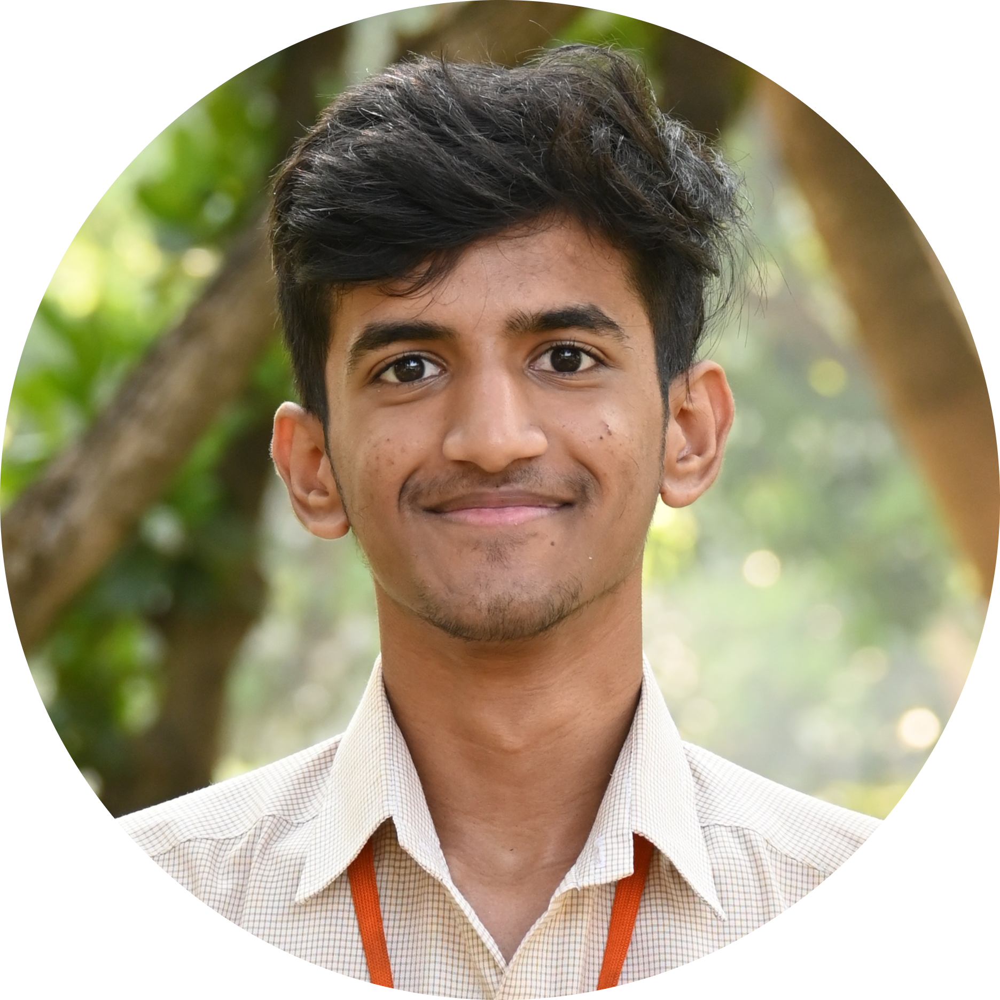

    
    

## Blockchain - Research Interest Group (B-RIG)

    

### Core Team: 2022 - 2023

<table>
    <tr>
        <td></td>
        <td> Mr. Ramaguru Radhakrishnan   
         Faculty Coordinator / Mentor / Founder   
         BRIG.22.0001 </td> 
    </tr>
    <tr>
        <td> </td>
        <td>Vinayak R   
        President  
		BRIG.22.0012 </td>		
    </tr>
    <tr>
        <td> </td> 
        <td>Manomithran G   
        Vice - President   
		BRIG.22.0013 </td>	 
    </tr>
    <tr> 
        <td> </td> 
        <td>Mittul R   
        Secretary   
		BRIG.23.0015 </td>
    </tr>
    <tr>
        <td> </td> 
        <td>Nagireddy Venkata Revan   
        Vice - Secretary   
		BRIG.23.0016 </td>
    </tr>
    <tr>
        <td> </td> 
        <td>Karanam Hitesh Manjunath   
        Treasurer  
		BRIG.22.0017 </td>
    </tr>
    <tr>
		<td> </td> 
		<td>Kishore M  
		Public Relations Officer  
		BRIG.23.0018  
    </tr>  
</table>

